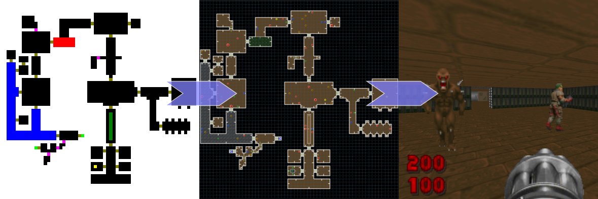

# PNG2WAD

A C# (.Net/Mono) command line tool to turn BMP/PNG images to Doom maps.
Not interested in the source code and just want to have fun? You'll find binaries in the **bin/Release** directory.

**Depends on two other open source projects you can find in my GitHub:**
- [ToolsOfDoom](https://github.com/akaAgar/tools-of-doom) to create Doom maps and wad files
- [INIPlusPlus](https://github.com/akaAgar/ini-plus-plus) to load Preferences.ini

## Features
- Any bitmap size
- Supports doors, secret passages, special sectors, entrances, exits,  variable floor/ceiling height.
- Theme configuration to create maps with various feelings and textures (hell, tech base, sewers...)
- Can generate maps in the Doom 1 (ExMx) or Doom 2 (MAPxx) name format.
- Optional things generation to create immediately playable maps filled with monsters and items. Or you can disable the thing generator and populate the map yourself using a map editor such as [Doombuilder](http://www.doombuilder.com/).
- Includes [Bsp](http://games.moria.org.uk/doom/bsp/) for node generation on Windows. On macOS/Linux you'll have to build nodes manually using a third-party node builder before you can play your maps.

## Usage

### Using the command-line
Syntax is: **PNG2WAD.exe SomeImage.png \[SomeOtherImage.png\] \[YetAnotherImage.png\]...**

### From the GUI
Drag and drop one or more PNG files on **PNG2WAD.exe**

### Output

Output file will always be generated in the directory where PNG2WAD.exe is located and will have a the name of the first PNG file with a wad extension. For instance, if you create a file from SomePlace.png, SomeOtherPlace.png and AThirdPlace.png, the output file will be named SomePlace.wad.

If Doom 1 format has been selected in Preferences.ini, first map will be named ExM1, then ExM2, etc (Where x is the number of the episode as defined in Preferences.ini). Maps beyond ExM9 will be ignored.
If Doom 2 format has been selected in Prefrences.ini, first map will be named MAP01, then MAP02, MAP03, etc. Maps beyond MAP99 will be ignored.
Default format is **Doom 2**.

## Creating images

Run your favorite image edition tool and create a new PNG of any size. Each pixel is a 64x64 tile on the map.

### Theme
The upper-left pixel is always a wall. Its color is ignored and used to select the map theme, as defined in the Preferences.ini file. You can add more themes by editing the file.

Available themes are:

- Gray (128, 128, 128): cave
- Red (255, 0, 0): hell
- Steel blue (128, 128, 255) : city
- Any other color: tech base (default)

### Image pixels
| Pixel color           | Tile type                                                    |
| --------------------- | ------------------------------------------------------------ |
| White (255, 255, 255) | Wall                                                         |
| Red (255, 0, 0)       | Room with special floor (nukage, lava,  etc.) as defined in the map theme |
| Green (0, 128, 0)     | Room with special ceiling (lamp, etc.) as defined in the map theme |
| Blue (0, 0, 255) | Room with open sky (exterior) |
| Olive (128, 128, 0) | Door |
| Magenta (255, 0, 255) | Secret passage |
| Yellow (255, 255, 0) | Entrance/player start |
| Lime (0, 255, 0) | Exit |
| Any other color       | Room                                                         |

